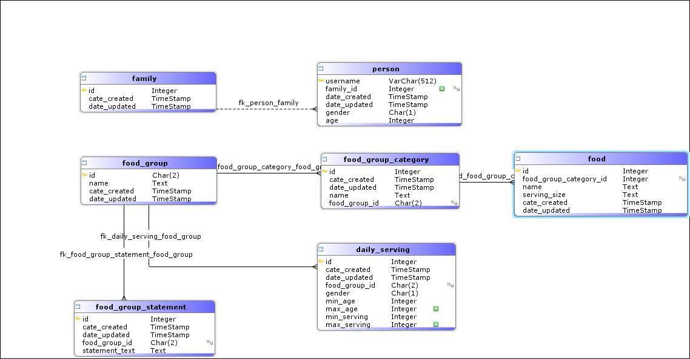

## SensorUp Technical Challenge

### Overview

This application was built using SpringBoot, Maven, and Java-8. The project layout is pretty standard and includes packages for spring controllers, repositories, services, models etc. For persistence I chose an in-memory H2 relational database for ease of packaging and running the application. When the appliation starts up, it reads the CSV files from within the project and imports the data into the database. Once running, there is no GUI, only REST endpoints.

#### Entity Diagram



#### Technologies Used

- SpringBoot
- Maven
- JUnit
- H2 in-memory database
- OpenCSV
- Java 8

#### What could be improved

I would have loved to spend more time on this! It's a "sky is the limit" type of assignment and there are things that could easily be improved:

- Validation: many parts of this application could use better data validation. In particular when importing/parsing food data from CSV files, or when handling REST requests/parameters.
- Code comments: I am not a big fan of densely commentended code, however there are many spots in this application where I could have done a better job of documenting critical sections.
- I would have loved to included instructions for deploying this application to AWS, Heroku, or Google App Engine. However I just ran out of time.
- Tests: I wrote a few tests for services and controller but they are nowhere near extensive enough.
- I would liked to have done a front-end for this. Admittedly my front-end skills are starting to get a bit rusty (as much as I do enjoy it). Personally I like VueJS.
- I would have liked to add Swagger or use some tool to document the APIs (and automatically create a GUI for testing them).
- The family menu API is pretty un-smart. It only lists the menu for each user. I should instead optimize the menu to reduce the number of unique foods.
- I would have liked to version my APIs
- I would have liked to introduce some security (OAuth etc)

### Running Application

1. Check out from the GIT repository:

   `git clone https://github.com/neilgrover/signal.git`

2. Enter directory and compile project

   `cd signal && mvn clean install`

3. Run the project

   `mvn spring-boot:run`

4. Check that data was populated into the in-memory H2 database

   1. In a browser, go to: http://localhost:8080/h2-console
   2. for the jdbc URL enter: *jdbc:h2:mem:foodguide*
   3. for the user name enter *sa* and password is blank
   4. click "connect" and you should be taken to a GUI where you can see the food-guide data in the tables.

5. Test the APIs using your preferred REST client (Postman, Insomnia etc). See notes.

#### REST Endpoints

There are a few things you'll want to do in order to see the application function as intended. There application has the concept of *people*, *family*, *food*, *food-group* etc (see entity diagram). While you are free to test these endpoints in any order you want, I will outline the steps below (in a working order) on calls that can be made to setup two people, make them a family, and see their menu(s).

1. Add a person

   **POST** : http://localhost:8080/person

   **BODY**: 
    ```javascript
   {
   ​	"username": "neil-grover",
   ​	"age": 41,
   ​	"gender": "m"
   }
    ```

2. Add another person

   **POST** : http://localhost:8080/person

   **BODY**: 
   ```javascript
   {
   ​	"username": "annika-grover",
   ​	"age": 12,
   ​	"gender": "Female"
   }
   ```

3. Retrieving a user

   At this point you can verify the users have been added

   **GET** : http://localhost:8080/person/annika-grover

   **RESPONSE**:
   ```javascript
   {
   ​	"dateCreated": "2018-10-02T10:53:12.971+0000",
   ​	"dateUpdated": "2018-10-02T10:53:12.971+0000",
   ​	"username": "annika-grover",
   ​	"familyId": null,
   ​	"gender": "FEMALE",
   ​	"age": 12
   }
   ```

4. Create a family and add users

   **POST** : http://localhost:8080/family

   **BODY**:
   ```javascript
   {
   ​	"usernames": [
   ​		"annika-grover",
   ​		"neil-grover"
   ​	]
   }
   ```
   **RESPONSE**:
   ```javascript
   {
   ​	"dateCreated": "2018-10-02T09:45:40.135+0000",
   ​	"dateUpdated": "2018-10-02T09:45:40.135+0000",
   ​	"id": 1,
   ​	"people": [
   ​		{
   ​			"dateCreated": "2018-10-02T09:45:24.019+0000",
   ​			"dateUpdated": "2018-10-02T09:45:24.019+0000",
   ​			"username": "annika-grover",
   ​			"familyId": 1,
   ​			"gender": "FEMALE",
   ​			"age": 12
   ​		},
   ​		{
   ​			"dateCreated": "2018-10-02T09:45:30.176+0000",
   ​			"dateUpdated": "2018-10-02T09:45:30.176+0000",
   ​			"username": "neil-grover",
   ​			"familyId": 1,
   ​			"gender": "MALE",
   ​			"age": 41
   ​		}
   ​	]
   }
   ```

5. Get a family for a single username

   **GET** : http://localhost:8080/family/annika-grover

   **RESPONSE**:
   ```javascript
   {
   ​	"dateCreated": "2018-10-02T09:45:40.135+0000",
   ​	"dateUpdated": "2018-10-02T09:45:40.135+0000",
   ​	"id": 1,
   ​	"people": [
   ​		{
   ​			"dateCreated": "2018-10-02T09:45:24.019+0000",
   ​			"dateUpdated": "2018-10-02T09:45:24.019+0000",
   ​			"username": "annika-grover",
   ​			"familyId": 1,
   ​			"gender": "FEMALE",
   ​			"age": 12
   ​		},
   ​		{
   ​			"dateCreated": "2018-10-02T09:45:30.176+0000",
   ​			"dateUpdated": "2018-10-02T09:45:30.176+0000",
   ​			"username": "neil-grover",
   ​			"familyId": 1,
   ​			"gender": "MALE",
   ​			"age": 41
   ​		}
   ​	]
   }
   ```

6. Get the menu for a single user

   **GET** : http://localhost:8080/menu/annika-grover

   **RESPONSE**: It's rather large so I'll describe it instead.

   The response lists out the users details as well as a "menu" containing suggested foods that meet their minimum serving requirements. The foods are broken down by food-group and food-group-category.

7. Get the menu for a family of users

   **GET** : http://localhost:8080/family-menu/annika-grover

   **RESPONSE**: Looks much like the response for single user menu but lists one for each family. This could be much improved by combining foods between family members to lower the ingredient count.

### Evaluation Checklist
<ul class="contains-task-list">
    <li class="task-list-item"><input checked="checked" type="checkbox" id="" disabled="" class="task-list-item-checkbox"> Good commits that show the progression</li>
<li class="task-list-item"><input checked="checked" type="checkbox" id="" disabled="" class="task-list-item-checkbox"> Simplicity and good design patterns and architectural principals</li>
<li class="task-list-item"><input checked="checked" type="checkbox" id="" disabled="" class="task-list-item-checkbox"> Proficiency with current versions of tools, frameworks, and languages</li>
<li class="task-list-item"><input type="checkbox" id="" disabled="" class="task-list-item-checkbox"> User stories accepted by PM</li>
<li class="task-list-item"><input checked="checked" type="checkbox" id="" disabled="" class="task-list-item-checkbox"> Easy for the reviewer to run or deploy</li>
<li class="task-list-item"><input checked="checked" type="checkbox" id="" disabled="" class="task-list-item-checkbox"> Test one component with an automated test</li>
<li class="task-list-item"><input type="checkbox" id="" disabled="" class="task-list-item-checkbox"> Apply one DevOps principal</li>
<li class="task-list-item"><input type="checkbox" id="" disabled="" class="task-list-item-checkbox"> Demonstrate one Security best practice</li>
<li class="task-list-item"><input checked="checked" type="checkbox" id="" disabled="" class="task-list-item-checkbox"> Illustrates Git and Github best practices</li>
<li class="task-list-item"><input checked="checked" type="checkbox" id="" disabled="" class="task-list-item-checkbox"> Solid readme</li>
</ul>
#### *Evaulation Notes:

I used Git-Flow (master -> develop -> feature-branch) approach. I then created some merge requests to get my feature branches back down through to develop -> master

I ran out of time for security, user stories etc.